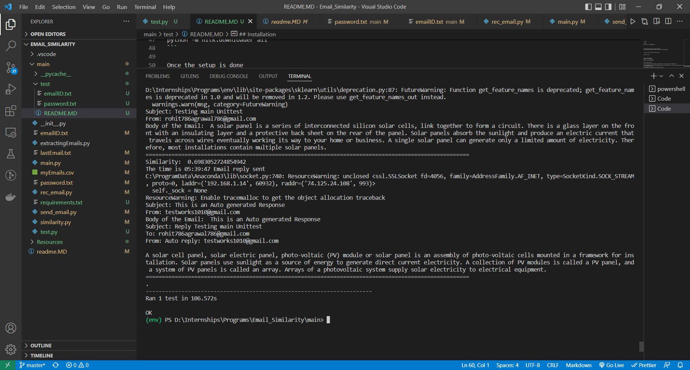

Testing The application

## Installation


Clone the Repository using the following command.


```bash

git clone -b master https://gitlab.com/AlphaDino/mailaitooling.git

python3 -m venv env

./env/Script/activate

```


```bash

cd main

pip install -r requirements.txt

```


The main directory consist o the main programs
The resources directory has resource files for while building model


To use the script first need to install nltk

```
pip install nltk

```


once nltk is installed 
need to install nltk tools
```
python -m nltk.downloader all
```

Once the setup is done

add the Acoount eamilID and password in the emailID.txt and password.txt files respectively

and for tetsing add one more email credientials which will send the email as a client to the users email, in the test directory emailID.txt and password.txt file 

after adding the credientials just run the test.py file
```
python test.py
```

If everything worked well the the output should be 
