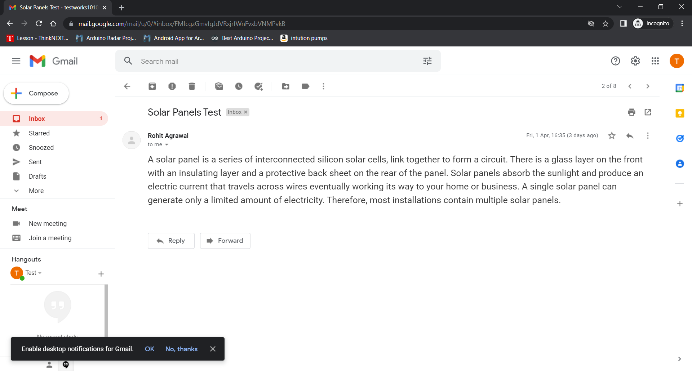
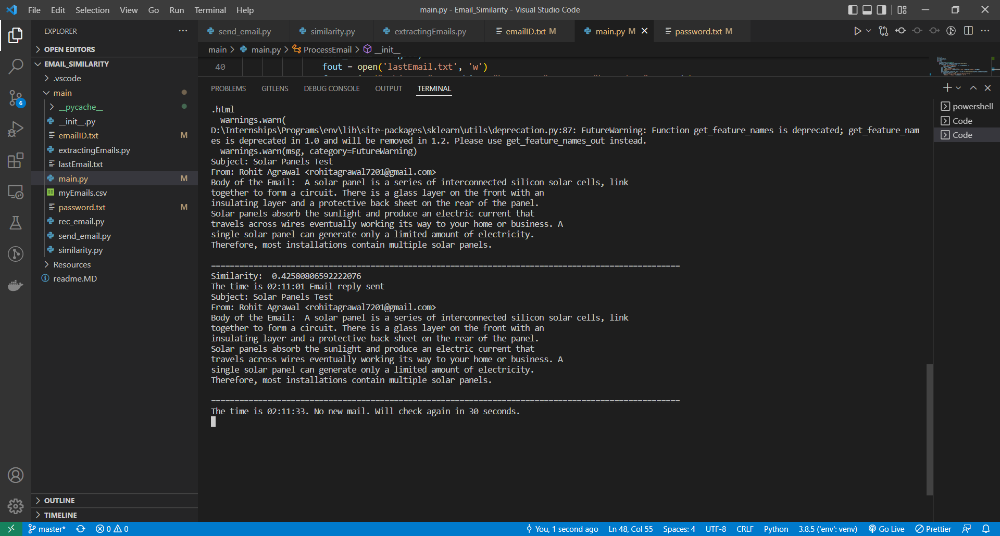
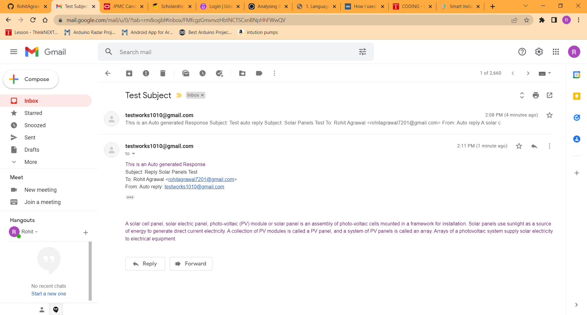

## Installation


Clone the Repository using the following command.


```bash

git clone -b master https://gitlab.com/AlphaDino/mailaitooling.git

python3 -m venv env

./env/Script/activate

```


```bash

cd main

pip install -r requirements.txt

```


The main directory consist o the main programs
The resources directory has resource files for while building model


To use the script first need to install nltk

```
pip install nltk

```


once nltk is installed 
need to install nltk tools
```
python -m nltk.downloader all
```

Once the setup is done

add the Acoount eamilID and password in the emailID.txt and password.txt files respectively

## Usage


once it is done

from any account send a mail to the account whos credientials is entered in the program
with mail body as 
```
A solar panel is a series of interconnected silicon solar cells, link together to form a circuit. There is a glass layer on the front with an insulating layer and a protective back sheet on the rear of the panel. Solar panels absorb the sunlight and produce an electric current that travels across wires eventually working its way to your home or business. A single solar panel can generate only a limited amount of electricity. Therefore, most installations contain multiple solar panels.
```

as a similar content is being feeded to the model and once you send this email

run the main file wile being in the main directory
```
python main.py
```

in some time the program will check the recently recived email and after processing the email
if the similarity is more than 35% will send a reply with the similar content in the dataset


## Purpose

The Program is designed with a view for a email account 
To reply with a recived email with a approximate reply if it is in the dataset so that
the user dosn't need to reply same types of emails again and again insted the MailAITool will do that for him.

## Description

The main file is used to login the the user with its emailid and password 
into the program and to ascess the emails recived to user


The program will also need the previous emails of the user to make the model
so to get the previous email in the .mbox format
from the account go to https://takeout.google.com/settings/takeout
and selet the gmail option and export the emails according to the lables


in some time a email will be recived on the emailid about the zip file with the .mbox file in it extract it in the desired locationso that the program can ascess it futher

After save the location of the .mbox file and run the extractEmail.py file which should be run only one time.
The extractEmail file takes an input of the location of the file and extract the emails indiviudually and then add them in a pandas dataframe.
The dataframe of all the emails then is converted to myEmail.csv file which will be used by the main program to start the MailAITool 

once the extractEmail file runs sucessfully 

add the EmailID and password of the account on which the MailAITool has to be run 
and simply exicute the main.py file which will start the program which will continously

The main.py file after login the user continuesly checks for new email recived by email
and if a new email is recived checks the similar of the email using similarity.py from the inbox and if there is a similar email available then will automaticly reply to it.


The send_email python program is use to send an mail provided with the subject, body and the recivers email address

The rec_email program is use to rec the emails recived in the inbox of the account
the rec_email program is contineously running in the main.py file in evry 30 to check that if a new email is recived 


similarity module contains Similarity class which do the processing of previous emails of te user and for every new email give the similar email in return 

## API

The app.py file for API to access the MailAITool
to run it 

install required librearies
```
pip install flask

pip install flask_restful

pip install requests
```
In main Dir
```
python app.py
```
will run the app on default port 5000

To sccess the API the URL would be 
```
http://<address>/mail/
```
The app accepts POST request with arguments of users emailID and password
and will run the main module and will start the MailAITool program on the account


**myapp**

The myapp.py is to use the api
the module sends request to the app.py mail routeand starts the program

## Results
After running the program 


Sending the email


The program Output


The Auto-Replied email from the program



## For Gmail account

If using Gmail as your email service then before using the program You need to allow less secure app access

refer - https://hotter.io/docs/email-accounts/secure-app-gmail/ for the process

